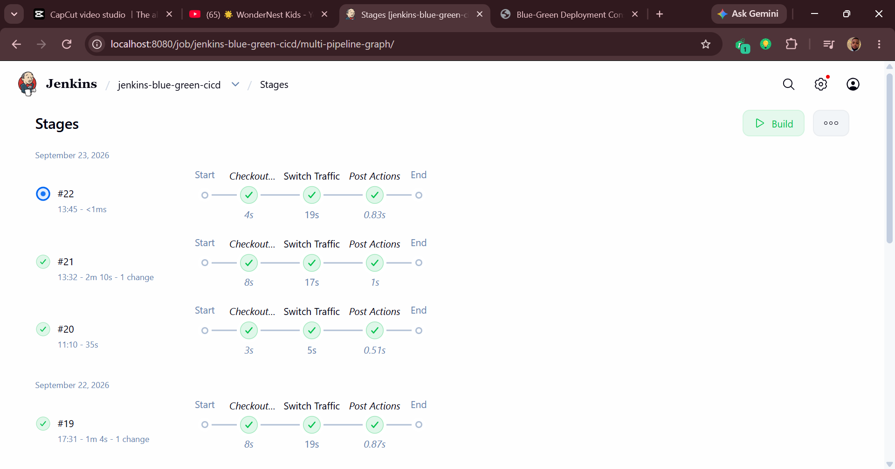

# 🚀 Blue-Green CI/CD Deployment with Jenkins, Docker & Nginx

<div align="center">

### Zero-Downtime Deployments • Automated Traffic Switching • Health Checks • Instant Rollback

*A production-style Blue-Green Deployment pipeline built with Jenkins, Docker Compose, Nginx, and GitHub.*


</div>

---

## 📌 Project Overview

This project demonstrates a **production-style Blue-Green Deployment strategy** using **Jenkins**, **Docker Compose**, and **Nginx** to achieve **zero-downtime application releases**.

Instead of deploying directly to production, Jenkins deploys a new application version to a **standby (Green)** environment, validates it through automated health checks, and only then switches live production traffic from **Blue** to **Green**.

If a deployment fails or an issue is detected, traffic can be switched back instantly without rebuilding or restarting the application, providing a fast and reliable rollback mechanism.

This project simulates a real-world CI/CD deployment workflow commonly used in modern DevOps environments.

---

## 📑 Table of Contents

- [Architecture Diagram](#-architecture-diagram)
- [Project Architecture](#-project-architecture)
- [Features](#-features)
- [Tech Stack](#-tech-stack)
- [Project Structure](#-project-structure)
- [Docker Compose Services](#️-docker-compose-services)
- [Blue-Green Deployment Workflow](#-blue-green-deployment-workflow)
- [Jenkins Pipeline](#-jenkins-pipeline)
- [Nginx Reverse Proxy Configuration](#-nginx-reverse-proxy-configuration)
- [Health Check](#-health-check)
- [Dynamic Frontend Detection](#-dynamic-frontend-detection)
- [Getting Started](#-getting-started)
- [Testing](#-testing)
- [Screenshots](#-screenshots)
- [Deployment Flow](#-deployment-flow)
- [DevOps Skills Demonstrated](#-devops-skills-demonstrated)
- [Future Improvements](#-future-improvements)
- [About This Project](#-about-this-project)

---

# 🏗️ Architecture Diagram

This architecture illustrates the complete Blue-Green CI/CD workflow using **GitHub**, **Jenkins**, **Docker**, and **Nginx**. Jenkins deploys a new version to the standby environment, validates it through health checks, and performs a zero-downtime traffic switch using Nginx.

<p align="center">
  
</p>

> **Want to see the deployment in action?** Scroll down to the **📸 Screenshots** section for Jenkins pipeline execution, traffic switching, rollback verification, and Docker container screenshots.

---

# 🎯 Project Architecture

```text
                     GitHub Repository
                           │
                Webhook / Manual Trigger
                           │
                    Jenkins CI/CD Pipeline
                           │
          ┌────────────────┴────────────────┐
          │                                 │
     Build Blue Image                  Build Green Image
          │                                 │
     Blue Container                    Green Container
      (v1.0.0)                          (v1.1.0)
      Port 5001                         Port 5002
          │                                 │
          └──────────────┬──────────────────┘
                         │
                 Nginx Reverse Proxy
              (Traffic Switch Controller)
                    Port 5000
                         │
                    User / Browser
```

---

# ✨ Features

- ✅ Blue-Green Deployment strategy.
- ✅ Zero-downtime traffic switching.
- ✅ Jenkins Declarative Pipeline.
- ✅ Docker Compose orchestration.
- ✅ Nginx reverse proxy load balancing.
- ✅ Automated health verification.
- ✅ Dynamic environment version detection.
- ✅ Instant rollback capability.
- ✅ GitHub source-controlled deployment pipeline.

---

# 🛠️ Tech Stack

| Technology | Purpose |
|------------|---------|
| **Jenkins** | CI/CD automation pipeline |
| **Docker** | Containerization |
| **Docker Compose** | Multi-container orchestration |
| **Nginx** | Reverse proxy and traffic switching |
| **GitHub** | Source control |
| **PowerShell** | Deployment and rollback scripts |
| **HTML / CSS / JavaScript** | Demo application dashboard |

---

# 📁 Project Structure

```text
jenkins-blue-green-cicd/
│
├── app/
│   ├── index.html
│   ├── style.css
│   ├── app.js
│   └── config.json
│
├── nginx/
│   └── default.conf
│
├── scripts/
│   ├── deploy-green.ps1
│   ├── health-check.ps1
│   └── rollback.ps1
│
├── screenshots/
│   ├── architecture-diagram.png
│   ├── jenkins-success.png
│   ├── docker-compose-ps.png
│   ├── dashboard-blue.png
│   ├── dashboard-green.png
│   └── rollback.png
│
├── Dockerfile
├── Dockerfile.jenkins
├── docker-compose.yml
├── Jenkinsfile
└── README.md
```

> 📸 All deployment screenshots and verification images are available in the **Screenshots** section below.

---

# ⚙️ Docker Compose Services

The project runs four containers connected through a shared Docker network.

| Service | Port | Description |
|---------|------|-------------|
| **Blue App** | `5001` | Live production environment (`v1.0.0`) |
| **Green App** | `5002` | Standby deployment environment (`v1.1.0`) |
| **Nginx** | `5000` | Reverse proxy and traffic switch controller |
| **Jenkins** | `8080` | CI/CD automation server |

**Shared Network**

```yaml
bluegreen-network
```

---

# 🔄 Blue-Green Deployment Workflow

## Step 1 — Developer Pushes Code

```text
Developer
   │
   ▼
GitHub Repository
```

Jenkins detects a GitHub push or a manual trigger.

---

## Step 2 — Jenkins Builds Images

Jenkins checks out the latest code and builds two Docker images.

```bash
docker compose build --no-cache blue green
```

Blue image contains:

```json
{
  "environment":"BLUE",
  "version":"v1.0.0"
}
```

Green image contains:

```json
{
  "environment":"GREEN",
  "version":"v1.1.0"
}
```

---

## Step 3 — Deploy Green

Green is deployed while Blue continues serving production traffic.

```bash
docker compose up -d green
```

Blue remains live throughout deployment.

---

## Step 4 — Health Check

Jenkins validates the Green environment before switching traffic.

```bash
curl http://green-app/health
```

Expected response:

```text
Healthy
```

Deployment stops automatically if the health check fails.

---

## Step 5 — Switch Production Traffic

Jenkins updates the Nginx reverse proxy configuration.

Before deployment:

```nginx
proxy_pass http://blue_backend;
```

After deployment:

```nginx
proxy_pass http://green_backend;
```

Then Jenkins reloads Nginx.

```bash
docker exec blue-green-nginx nginx -t
docker exec blue-green-nginx nginx -s reload
```

Traffic switches instantly with zero downtime.

---

## Step 6 — Verification

Jenkins confirms the active backend.

```bash
docker exec blue-green-nginx grep proxy_pass /etc/nginx/conf.d/default.conf
```

Expected output:

```text
proxy_pass http://green_backend;
```

---

## Step 7 — Rollback

Rollback immediately redirects production traffic back to Blue.

```nginx
proxy_pass http://blue_backend;
```

No rebuilds or container restarts are required.

---

# ⚡ Jenkins Pipeline

The Jenkins Declarative Pipeline automates traffic switching after deployment and health verification.

```groovy
pipeline {
    agent any

    environment {
        NGINX_CONTAINER = "blue-green-nginx"
        TARGET_ENV = "GREEN"
        NGINX_CONFIG = "/workspace/nginx/default.conf"
    }

    stages {

        stage('Switch Traffic') {

            steps {

                script {

                    def targetBackend = env.TARGET_ENV == "GREEN" ?
                        "green_backend" : "blue_backend"

                    sh """
                        set -e

                        sed 's|proxy_pass http://blue_backend;|proxy_pass http://${targetBackend};|g' \
                        ${NGINX_CONFIG} > /tmp/default.conf

                        cat /tmp/default.conf | docker exec -i ${NGINX_CONTAINER} \
                        tee /etc/nginx/conf.d/default.conf >/dev/null

                        docker exec ${NGINX_CONTAINER} nginx -t
                        docker exec ${NGINX_CONTAINER} nginx -s reload

                        docker exec ${NGINX_CONTAINER} grep -q \
                        "proxy_pass http://${targetBackend};" \
                        /etc/nginx/conf.d/default.conf
                    """

                    echo "Traffic switched successfully."

                }

            }

        }

    }

}
```

---

# 🔁 Rollback Strategy

Rollback is implemented as a dedicated Jenkins stage. Instead of redeploying an older application version, Jenkins simply redirects traffic back to the previously healthy environment.

```groovy
stage('Rollback') {
    when {
        expression { return params.ROLLBACK == true }
    }

    steps {
        script {
            sh """
                ACTIVE_BACKEND=\$(docker exec blue-green-nginx sh -c \
                "grep proxy_pass /etc/nginx/conf.d/default.conf")

                if echo "\$ACTIVE_BACKEND" | grep green_backend >/dev/null; then
                    TARGET=blue_backend
                else
                    TARGET=green_backend
                fi

                sed "s|proxy_pass http://.*_backend;|proxy_pass http://\$TARGET;|g" \
                /workspace/nginx/default.conf > /tmp/default.conf

                cat /tmp/default.conf | docker exec -i blue-green-nginx \
                tee /etc/nginx/conf.d/default.conf >/dev/null

                docker exec blue-green-nginx nginx -t
                docker exec blue-green-nginx nginx -s reload
            """

            echo "Rollback completed successfully."
        }
    }
}
```

This approach provides **instant recovery** without rebuilding Docker images or restarting containers.

---

# 🌐 Nginx Reverse Proxy Configuration

### Upstream Backends

```nginx
upstream blue_backend {
    server blue-app:80;
}

upstream green_backend {
    server green-app:80;
}
```

### Traffic Controller

```nginx
server {

    listen 80;

    location / {

        proxy_pass http://blue_backend;

        proxy_set_header Host $host;
        proxy_set_header X-Real-IP $remote_addr;
        proxy_set_header X-Forwarded-For $proxy_add_x_forwarded_for;
        proxy_set_header X-Forwarded-Proto $scheme;

    }

    location /health {

        access_log off;
        default_type text/plain;
        return 200 "Nginx is healthy\n";

    }

}
```

Only the `proxy_pass` directive changes during deployment or rollback.

---

# 🩺 Health Check

Verify the Nginx reverse proxy.

```bash
curl http://localhost:5000/health
```

Output:

```text
Nginx is healthy
```

Verify the Green application.

```bash
curl http://localhost:5002/config.json
```

Output:

```json
{
  "environment":"GREEN",
  "version":"v1.1.0"
}
```

---

# 🧠 Dynamic Frontend Detection

The application dashboard automatically displays whichever environment is currently serving traffic.

```javascript
const response = await fetch("/config.json");
const data = await response.json();

document.getElementById("environment-small").textContent = data.environment;
document.getElementById("version").textContent = data.version;
```

Because `config.json` is generated during the Docker build, the dashboard updates dynamically after every traffic switch.

---

# 🚀 Getting Started

## Clone the Repository

```bash
git clone https://github.com/TempleStephen/jenkins-blue-green-cicd.git

cd jenkins-blue-green-cicd
```

---

## Build Docker Images

```bash
docker compose build --no-cache blue green
```

---

## Start All Containers

```bash
docker compose up -d
```

---

## Verify Running Containers

```bash
docker compose ps
```

Expected containers:

```text
blue-app
green-app
blue-green-nginx
jenkins-server
```

---

# 🧪 Testing

## Verify Blue Environment

```bash
curl http://localhost:5001/config.json
```

Expected output:

```json
{
  "environment":"BLUE",
  "version":"v1.0.0"
}
```

---

## Verify Green Environment

```bash
curl http://localhost:5002/config.json
```

Expected output:

```json
{
  "environment":"GREEN",
  "version":"v1.1.0"
}
```

---

## Verify Active Production Environment

```bash
curl http://localhost:5000/config.json
```

Before deployment:

```json
{
  "environment":"BLUE",
  "version":"v1.0.0"
}
```

After deployment:

```json
{
  "environment":"GREEN",
  "version":"v1.1.0"
}
```

---

## Verify Active Backend

```bash
docker exec blue-green-nginx grep proxy_pass /etc/nginx/conf.d/default.conf
```

Expected output after cutover:

```text
proxy_pass http://green_backend;
```

Expected output after rollback:

```text
proxy_pass http://blue_backend;
```

---

# 📸 Screenshots

The following screenshots demonstrate the complete CI/CD workflow from deployment to rollback.

## 🏗️ Architecture Diagram


---

## ✅ Jenkins Pipeline Success



---

## 🔵 Blue Environment (Live Production)


---

## 🟢 Green Environment (After Deployment)


---

## 📦 Running Docker Containers


---

## 🔁 Rollback Verification


---

# 📈 Deployment Flow

| Stage | Action |
|-------|--------|
| **Checkout** | Pull latest GitHub repository. |
| **Build** | Build Blue and Green Docker images. |
| **Deploy** | Deploy the Green environment. |
| **Health Check** | Validate Green before production traffic. |
| **Switch Traffic** | Update Nginx routing configuration. |
| **Reload Nginx** | Apply routing changes without downtime. |
| **Verification** | Confirm Green is serving production traffic. |
| **Rollback** | Redirect traffic back to Blue if needed. |

---

# 🎓 DevOps Skills Demonstrated

- Jenkins Declarative Pipelines
- Docker Image Versioning
- Docker Compose Networking
- Nginx Reverse Proxy Configuration
- Blue-Green Deployment Strategy
- Zero-Downtime Releases
- Automated Health Checks
- Rollback Automation
- GitHub CI/CD Integration
- Linux Command-Line Automation

---

# 🔮 Future Improvements

- [ ] Deploy on AWS EC2.
- [ ] Push Docker images to Amazon ECR.
- [ ] Deploy workloads using Amazon ECS or EKS.
- [ ] Trigger Jenkins automatically using GitHub Webhooks.
- [ ] Add Prometheus and Grafana monitoring.
- [ ] Send Slack deployment notifications.
- [ ] Implement automatic rollback on failed health checks.

---

# 👨‍💻 About This Project

This project was built as part of my **Cloud & DevOps Engineering Portfolio** to demonstrate production-style CI/CD automation using Jenkins, Docker, GitHub, and Nginx.

The implementation focuses on real DevOps practices including **zero-downtime deployments**, **health validation**, **traffic switching**, and **instant rollback**—concepts commonly used in modern cloud infrastructure and deployment pipelines.

---

# 👤 Author

## Temple Stephen

**AWS Cloud & DevOps Engineer**

I build hands-on cloud infrastructure and CI/CD automation projects using AWS, Docker, Jenkins, Linux, GitHub Actions, and Infrastructure as Code.

### Connect With Me

- **GitHub:** https://github.com/TempleStephen
- **Upwork Portfolio:** https://tinyurl.com/6vwve75h

---

<div align="center">

### ⭐ If you found this project helpful, consider giving it a Star on GitHub!

**Blue-Green Deployment • Jenkins • Docker • Nginx • CI/CD**

</div>
